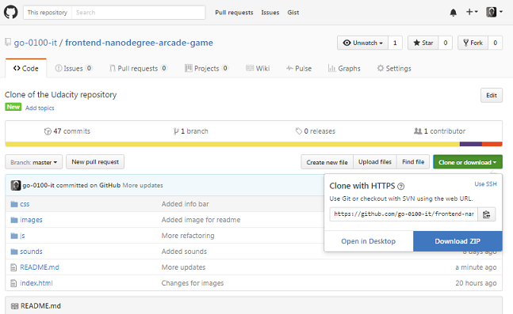
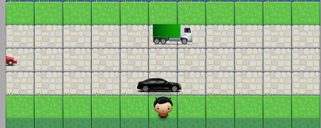
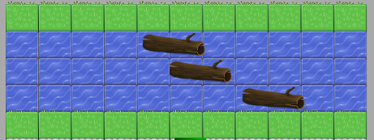
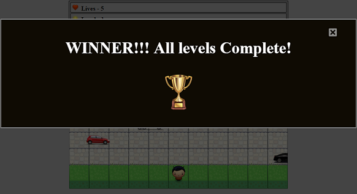

frontend-nanodegree-arcade-game
===============================

## How to run the game

To run the frontend-nanodegree-arcade-game;

1. download the zip file from the github repository to your machine

  
  
  
2. open the index.html file

  
  
  
3. the game will load with a prompt, press enter to start

  
  
  
4. Play the game! :+1:

## How to play the game

The object of the game is to navigate to the top of the game board for each of the 10 levels to obtain the winners trophy.

1. The first section of the board is the road, make it to the middle grass area without being hit by a vehicle.

  
  
  
2. The second section of the board is the river, hop on the logs and turtles to make it across the river to the top grass section, but be careful not to get washed off the screen!!
  
  
  
  
3. Once the player is at the top grass section the current level is complete, there are 10 levels in total to complete in order to obtain the winners trophy.

  
  
  
This game was created to satisfy the following project outline...

Students should use this [rubric](https://review.udacity.com/#!/projects/2696458597/rubric) for self-checking their submission. Make sure the functions you write are **object-oriented** - either class functions (like Player and Enemy) or class prototype functions such as Enemy.prototype.checkCollisions, and that the keyword 'this' is used appropriately within your class and class prototype functions to refer to the object the function is called upon. Also be sure that the **readme.md** file is updated with your instructions on both how to 1. Run and 2. Play your arcade game.

For detailed instructions on how to get started, check out this [guide](https://docs.google.com/document/d/1v01aScPjSWCCWQLIpFqvg3-vXLH2e8_SZQKC8jNO0Dc/pub?embedded=true).
